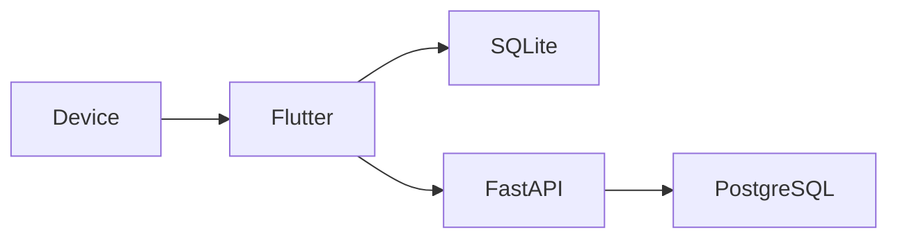
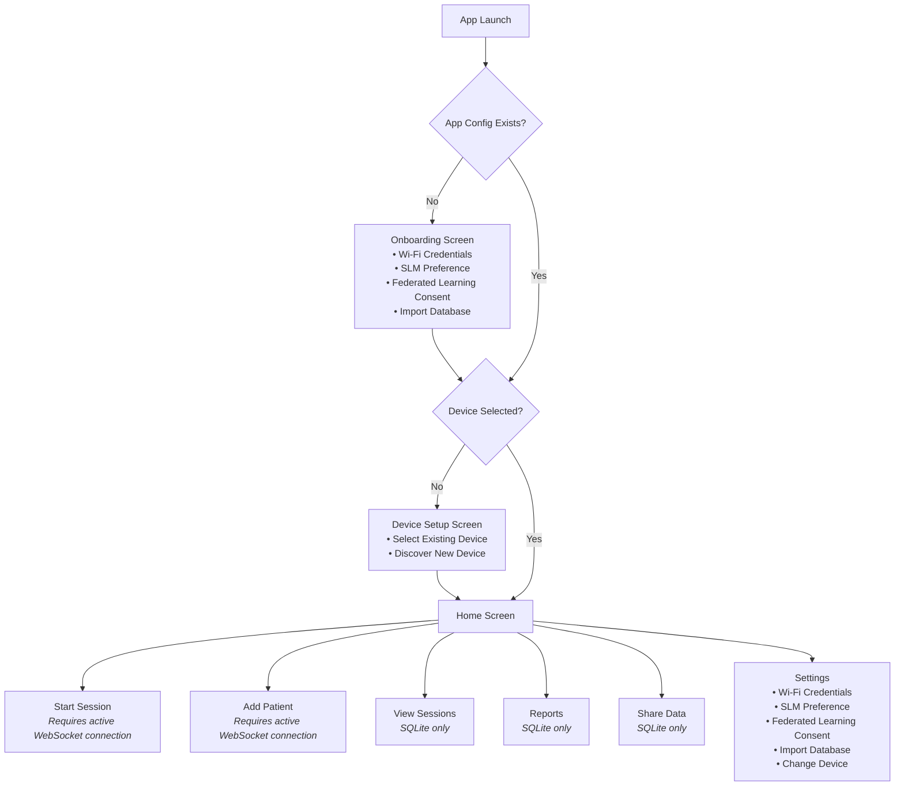
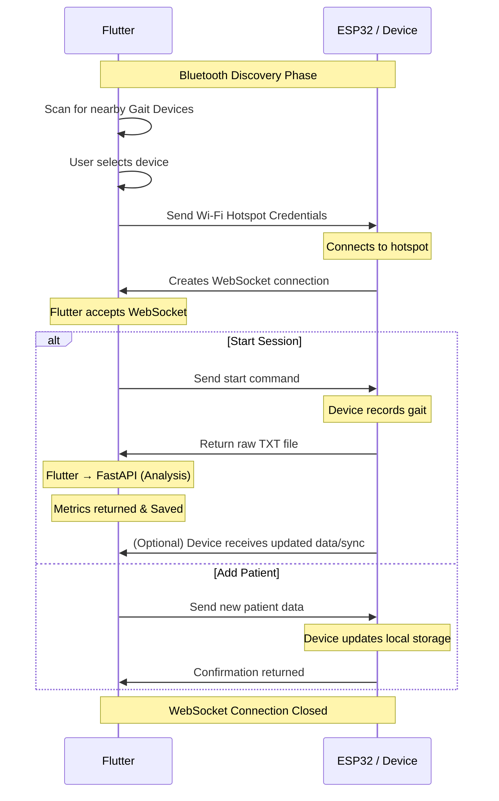
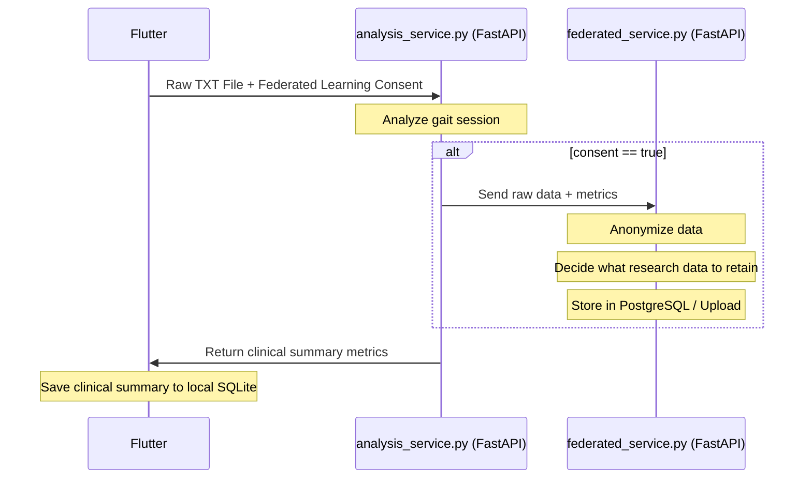

## Overview

This document describes the architecture of the Gait Physiotherapy System, including the Flutter application,  FastAPI backend, and data storage strategy.

The application performs gait analysis locally while optionally contributing anonymized data for research. Clinical session summaries are stored locally in SQLite, whereas consented research data is managed by the FastAPI backend and stored separately.



## Technology Stack

- Flutter — Mobile/Desktop Application
- FastAPI — Analysis and backend services
- SQLite — Local clinical database

# System Architecture & Data Flow

This document outlines the architecture, application flow, device connection protocols, and database schemas for the Gait Physiotherapy Demo app and its Fastapi backend.

## Overall Application Flow



---

## Device ↔ Flutter Connection Flow

A WebSocket connection is created **only when required** (e.g., Start Session or Add Patient). This ensures battery savings on the wearable and removes the need for constant background sync and network overhead.



---

## Session Analysis & Federated Learning (Conceptual Federated Learning) Flow



> **Note**: Flutter is responsible only for transmitting the user's consent status. All decisions regarding anonymization, research data extraction, storage, and federated learning are handled entirely by the FastAPI backend.
> The mobile application stores only clinically relevant summary metrics. Raw sensor recordings are not persisted locally. When the user has provided consent, the raw recording is forwarded to the FastAPI backend, which determines whether and how it should be retained for research purposes.

---

## Local Storage (SQLite Database)

All viewing, reporting, and history features work entirely from SQLite without requiring a live device connection.

### 1. App Configuration
```sql
CREATE TABLE app_config (
    ssid                         TEXT,
    password                     TEXT,
    remember_me                  INTEGER,
    slm_preference               TEXT,
    selected_device_id           TEXT,
    federated_learning_consent   INTEGER
);
```

### 2. Devices
```sql
CREATE TABLE devices (
    id    TEXT PRIMARY KEY,
    name  TEXT
);
```

### 3. Patients
```sql
CREATE TABLE patients (
    id            TEXT PRIMARY KEY,
    name          TEXT,
    age           INTEGER,
    date_arrived  TEXT
);
```

### 4. Sessions
```sql
CREATE TABLE sessions (
    id              TEXT PRIMARY KEY,
    device_id       TEXT,
    patient_id      TEXT,

    date            TEXT,
    start_time      TEXT,
    end_time        TEXT,

    sampling_rate   REAL,
    duration        REAL,

    steps_counted   INTEGER,
    avg_cadence     REAL,
    sparc           REAL,
    stance_pct      REAL,
    swing_pct       REAL,
    avg_step_time   REAL,
    avg_gait_speed  REAL,

    FOREIGN KEY(device_id) REFERENCES devices(id),
    FOREIGN KEY(patient_id) REFERENCES patients(id)
        ON DELETE CASCADE
);
```

---

## Research (FastAPI) Database

The research database is completely independent of the local SQLite database and managed entirely by the server.

Conceptual PostgreSQL Structure:
- **Session Metadata** (Anonymized demographics)
- **Session Summary Metrics** (Averages, cadence, SPARC)
- **Step-level Features** (Individual step timings)
- **Raw IMU Data** (Only for consented sessions, potentially stored in object storage linked to DB)

FastAPI determines what is uploaded and stored based on the provided data and consent flag.
