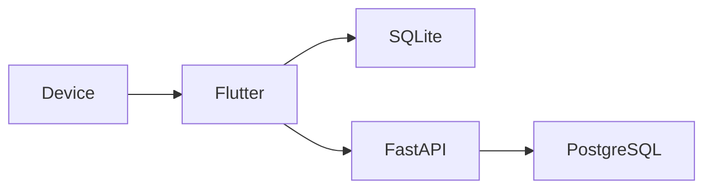
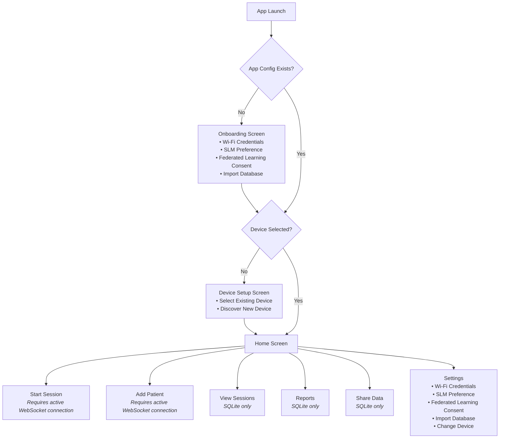
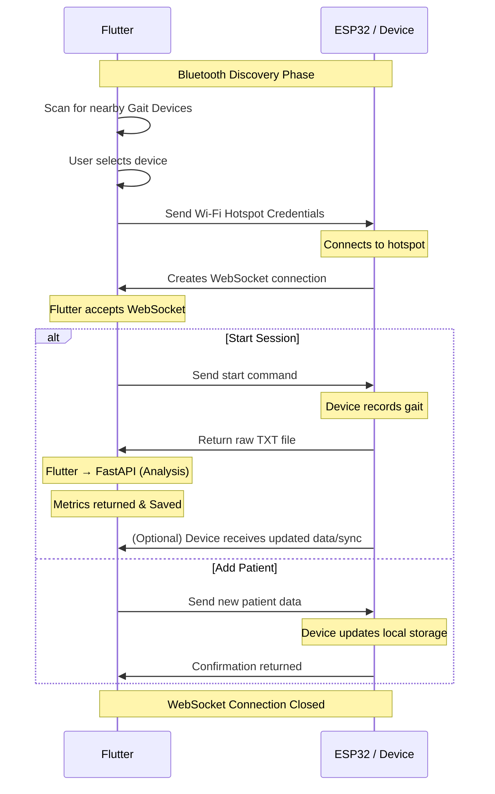
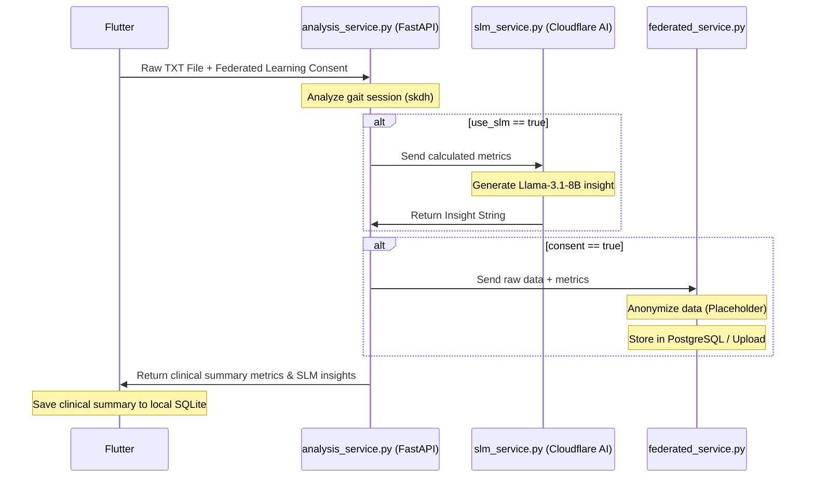

## Overview

This document describes the architecture of the Gait Physiotherapy System, including the Flutter frontend application, FastAPI backend, and data storage strategy.

The application performs gait analysis locally while optionally contributing anonymized data for research. Clinical session summaries are stored locally in SQLite, whereas consented research data is managed by the FastAPI backend and stored separately.



## Technology Stack

- **Flutter** — Mobile Application Frontend
  - **State Management**: `flutter_riverpod`
  - **Routing**: `go_router`
  - **Data Visualization**: `fl_chart`
  - **Local Database**: `sqflite`
  - **Hardware Interaction**: `flutter_blue_plus` (BLE), `wifi_iot` (Wi-Fi Hotspot)
- **FastAPI** — Analysis and backend services
  - **Gait Analysis**: `skdh` (Scikit Digital Health), `pandas`
  - **SLM Insights**: Cloudflare REST API (Meta Llama 3 models)
- **SQLite** — Local clinical database

# System Architecture & Data Flow

This document outlines the architecture, application flow, device connection protocols, and database schemas for the Gait Physiotherapy Demo app and its FastAPI backend.

## Overall Application Flow



---

## Device ↔ Flutter Connection Flow

A WebSocket connection is created **only when required** (e.g., Start Session or Add Patient). This ensures battery savings on the wearable and removes the need for constant background sync and network overhead.



---

## Session Analysis & Federated Learning Flow

The backend handles computationally heavy gait feature extraction and generates AI-driven physical therapy insights using Small Language Models (SLMs).



> **Note**: Flutter is responsible only for transmitting the user's consent status. All decisions regarding anonymization, research data extraction, storage, and federated learning are handled entirely by the FastAPI backend.
> The mobile application stores only clinically relevant summary metrics. Raw sensor recordings are not persisted locally to preserve device storage.

---

## Local Storage (SQLite Database Structure)

All viewing, reporting, and history features work entirely from SQLite (`lib/core/services/sqlite_service.dart`) without requiring a live device connection. The database allows file imports and generates test data from the `Settings` page.

### 1. Devices
```sql
CREATE TABLE devices (
    id TEXT PRIMARY KEY,
    name TEXT
)
```

### 2. Patients
```sql
CREATE TABLE patients (
    id TEXT PRIMARY KEY,
    name TEXT NOT NULL,
    age INTEGER NOT NULL,
    created_at TEXT NOT NULL
)
```

### 3. Sessions
```sql
CREATE TABLE sessions (
    id TEXT PRIMARY KEY,
    device_id TEXT NOT NULL,
    patient_id TEXT NOT NULL,
    leg TEXT NOT NULL,
    date TEXT NOT NULL,
    start_time TEXT NOT NULL,
    end_time TEXT NOT NULL,
    duration REAL NOT NULL,
    steps_counted INTEGER NOT NULL,
    avg_cadence REAL NOT NULL,
    movement_smoothness_sparc REAL NOT NULL,
    stance_pct REAL NOT NULL,
    swing_pct REAL NOT NULL,
    avg_step_time REAL NOT NULL,
    avg_gait_speed REAL NOT NULL,
    slm_insights TEXT,
    FOREIGN KEY (device_id) REFERENCES devices(id),
    FOREIGN KEY (patient_id) REFERENCES patients(id) ON DELETE CASCADE
)
```

---

## Backend Services Structure (`server/`)

The backend is built with FastAPI and runs asynchronously, providing endpoints for analysis and AI generation:

- **`main.py`**: Core FastAPI router exposing `/analyze` (for single session IMU processing) and `/generate` (for overall progression insights).
- **`services/analysis_service.py`**: Employs Scikit Digital Health (`skdh`) to parse `.txt` IMU files containing raw accelerometer data, utilizing the `GaitLumbar` model to extract stride length, cadence, stance/swing percentages, and SPARC.
- **`services/slm_service.py`**: Integrates with Cloudflare's AI REST API to generate specialized physical therapy context using Meta Llama models:
  - Single-session insights use `@cf/meta/llama-3.1-8b-instruct`.
  - Multi-session/multi-patient overall insights use `@cf/meta/llama-3.3-70b-instruct-fp8-fast`.
- **`services/federated_service.py`**: Handles incoming consented telemetry for future storage in an anonymized, federated database.
